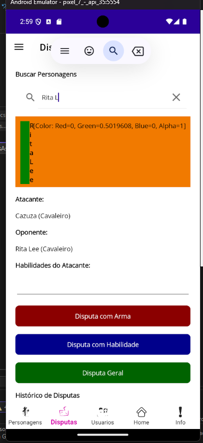

# 🛡️ App de Disputas RPG - .NET MAUI

Este é um aplicativo de lutas estilo RPG desenvolvido com **.NET MAUI**, com funcionalidades de combate entre personagens usando **armas**, **habilidades** ou **disputas gerais em grupo**.

### 👩‍💻 Desenvolvido por:
**Aline Borges Cunha**

---

## ✨ Funcionalidades

- 🔍 Pesquisa de personagens por nome
- ⚔️ Disputa com armas entre dois personagens
- 🧙‍♂️ Disputa com habilidades específicas
- 👥 Disputa geral com todos os personagens
- 🧾 Histórico de todas as disputas com narração
- 🔄 Reset de ranking e restauração de vidas

---

## 🖼️ Interface

| Tela de Disputas |
|------------------|
|  |

> Imagem real do app em execução

---

## 🧠 Tecnologias Usadas

- [.NET MAUI](https://learn.microsoft.com/pt-br/dotnet/maui/)
- C#
- MVVM Pattern
- REST API
- Visual Studio / Android Emulator

---

